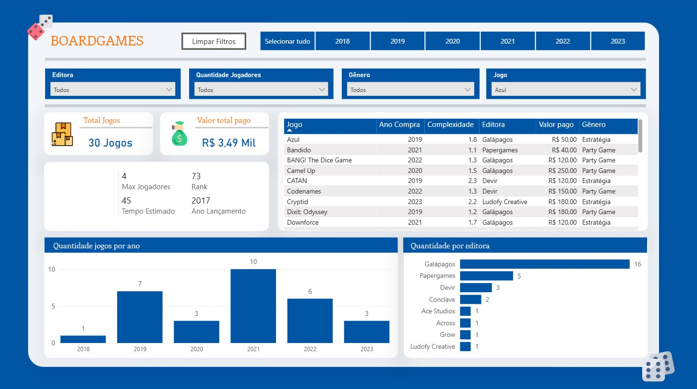

BoardGames Analytics Dashboard

Dashboard desenvolvido no Power BI para análise de uma coleção de jogos de tabuleiro, permitindo explorar informações de compras, editoras, gêneros, complexidade e evolução da coleção ao longo dos anos.

Principais Indicadores

- Total de jogos cadastrados
- Valor total investido na coleção
- Quantidade máxima de jogadores
- Ranking dos jogos
- Ano de lançamento
- Tempo estimado de partida

Funcionalidades

- Filtros por:
  - Editora
  - Quantidade de jogadores
  - Gênero
  - Jogo
  - Ano de compra

- Análise detalhada de cada jogo
- Histórico de compras por ano
- Distribuição de jogos por editora
- Consulta individual de jogos da coleção

Dashboard Principal

## Objetivo

O projeto tem como objetivo centralizar e analisar informações de uma coleção de jogos de tabuleiro, permitindo acompanhar investimentos, identificar padrões de compra e visualizar características da coleção de forma intuitiva.

Autor: Bruno Leite